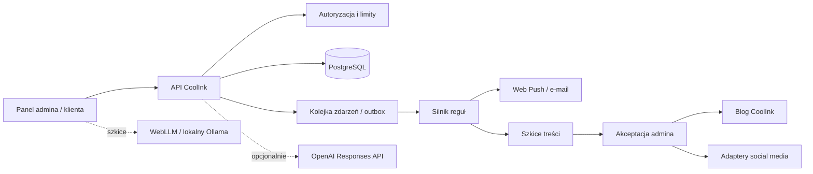
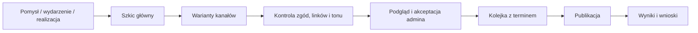

# CoolInk — roadmap AI, automatyzacji i rozwoju

Stan analizy: 11 września 2026. Dokument dotyczy obecnej aplikacji Next.js 16, Prisma/PostgreSQL, prywatnych mediów, Web Push oraz wdrożenia na Vercel.

## Decyzja w skrócie

Najlepsza wersja bez stałego kosztu AI nie polega na oddaniu aplikacji modelowi. Powinna mieć trzy warstwy:

1. **Automatyzacje deterministyczne** — reguły, szablony, przypomnienia, lista rezerwowa, kolejka publikacji i audyt. Są szybsze, przewidywalne i nie wymagają modelu.
2. **Asystent lokalny tylko dla studia** — najpierw WebLLM w przeglądarce albo Ollama na komputerze studia; tworzy szkice i podsumowania, ale niczego sam nie publikuje ani nie zmienia.
3. **Opcjonalny asystent chmurowy** — osobny endpoint aplikacji korzystający z OpenAI Responses API, gdy jakość lokalnego modelu okaże się niewystarczająca. To wariant płatny według użycia.

Nie da się bezpiecznie „podpiąć tej konkretnej rozmowy Codex” ani wykorzystać abonamentu ChatGPT jako darmowego API strony. ChatGPT i API mają osobne rozliczenia ([OpenAI — billing](https://help.openai.com/en/articles/9039756-chatgpt-search)), a bieżące modele API mają ceny za tokeny i brak bezpłatnego limitu modelowego ([OpenAI — modele](https://developers.openai.com/api/docs/models/compare)). Technicznie właściwą integracją chmurową jest Responses API z wąskimi, typowanymi funkcjami aplikacji ([OpenAI — Responses API](https://developers.openai.com/api/reference/cli/resources/responses/methods/create)).

## Architektura docelowa

Model ani treść z internetu nie mogą wywoływać ogólnych poleceń, zapytań SQL czy publikacji. Dostępne narzędzia powinny być osobnymi funkcjami, np. `draft_reply`, `summarize_project`, `suggest_available_slots`. Akcje zapisujące, wysyłające lub publikujące wymagają jawnego kliknięcia administratora.

## Asystent AI dla administratora

### Etap bezpłatny

Najpierw warto dodać panel **„Asystent CoolInk — wersja robocza”** z funkcjami:

- podsumowanie projektu, historii rozmowy i następnego kroku;
- szkic odpowiedzi w wybranym czacie;
- kontrola kompletności briefu i lista pytań do klienta;
- propozycja opisu portfolio, wydarzenia, wpisu blogowego i podpisu social;
- zamiana notatek w checklistę wizyty;
- wyszukiwanie semantyczne wyłącznie w zaakceptowanych dokumentach studia;
- przygotowanie tygodniowego planu komunikacji i wolnych terminów.

**WebLLM** wykonuje model bezpośrednio w przeglądarce z użyciem WebGPU, bez serwera ([repozytorium WebLLM](https://github.com/mlc-ai/web-llm)). Jest najłatwiejszy do prototypu, ale wymaga pobrania dużego modelu, nowej przeglądarki i odpowiedniej pamięci/GPU. Dlatego nadaje się bardziej do komputera studia niż jako obowiązkowy chatbot dla każdego klienta.

**Ollama** udostępnia lokalne API pod `localhost:11434` ([dokumentacja API](https://docs.ollama.com/api/introduction)) i obsługuje function calling ([dokumentacja narzędzi](https://docs.ollama.com/capabilities/tool-calling)). Nie należy wystawiać tego portu do internetu; lokalny endpoint nie wymaga uwierzytelnienia. Najbezpieczniej użyć osobnej aplikacji pomocniczej na komputerze studia albo lokalnego HTTPS z parowaniem urządzenia. To brak kosztu za tokeny, lecz nie brak kosztu sprzętu, prądu i administracji.

### Etap opcjonalny z OpenAI

Jeśli potrzebna będzie wyższa jakość lub działanie na każdym urządzeniu:

- serwerowy `/api/admin/ai`, nigdy klucz API w przeglądarce;
- najtańszy wystarczający model, ograniczenie długości wejścia/wyjścia i miesięczny twardy budżet;
- `store: false`, pseudonimizowany identyfikator bezpieczeństwa i minimalizacja przekazywanych danych;
- oddzielne narzędzia tylko do odczytu; każda mutacja po dodatkowej autoryzacji i potwierdzeniu;
- log audytowy: kto, kiedy, jaki zakres danych, jaka funkcja i jaki rezultat;
- żadnych danych klienta w treningowych przykładach ani publicznej bazie wiedzy.

### Asystent dla klienta

Bezpłatny i niezawodny wariant klienta powinien być przede wszystkim **inteligentnym przewodnikiem, nie otwartym chatbotem**:

- przyciski „Jak się przygotować?”, „Jak działa zadatek?”, „Jak wybrać termin?”;
- wyszukiwanie w zatwierdzonych dokumentach i FAQ;
- kreator briefu z pytaniami zależnymi od wcześniejszych odpowiedzi;
- podpowiadanie brakujących danych, ale bez diagnoz medycznych i bez rekomendowania leczenia;
- przekazanie rozmowy do człowieka jednym kliknięciem.

Lokalny WebLLM można zaoferować jako opcję „AI działa na Twoim urządzeniu”, z wykrywaniem WebGPU i klasycznym FAQ jako fallback. Nie należy wymagać pobierania modelu, aby umówić wizytę.

## Automatyzacja bloga i social mediów

### Bezpieczny przepływ publikacji

W bazie należy dodać:

- `ContentDraft`: temat, źródła, tekst bazowy, właściciel, status;
- `ContentVariant`: kanał, tekst, format, media, alt text;
- `Publication`: planowany czas, status, identyfikator platformy, liczba prób;
- `SocialConnection`: platforma, zaszyfrowany token, zakresy, wygaśnięcie;
- `AutomationRun`: wejście, rezultat, błąd, idempotency key i czas;
- `MediaConsent`: klient, projekt, konkretne zdjęcia, kanały, zakres i data wycofania.

Statusy: `draft → review → approved → scheduled → publishing → published/failed`. Model może tworzyć wyłącznie `draft`. Publikacja wymaga `approved`, nadal ważnej zgody na każde zdjęcie klienta i ponownej weryfikacji po zmianie treści.

### Adaptery kanałów

- **Blog CoolInk** — publikacja we własnej bazie, podgląd SEO, wersjonowanie, data publikacji i wycofanie.
- **Google Business Profile** — API obsługuje wpisy z wydarzeniem, ofertą, zdjęciem i CTA, ale wymaga zatwierdzenia projektu i OAuth ([Google Business Profile API](https://developers.google.com/my-business/content/posts-data)).
- **TikTok** — Content Posting API potrafi publikować film i zdjęcia; wymaga zarejestrowanej aplikacji, zakresu `video.publish`, zgody użytkownika i audytu, zanim treści testowego klienta staną się publiczne ([TikTok Direct Post](https://developers.tiktok.com/docs/en/content-posting-api-get-started)).
- **YouTube** — Data API obsługuje upload i metadane z OAuth, retry oraz ustawieniem prywatności ([YouTube upload](https://developers.google.com/youtube/v3/guides/uploading_a_video)).
- **Instagram/Facebook** — osobny adapter Meta z OAuth, kontem profesjonalnym i aktualnie wymaganymi uprawnieniami. Zakresy i proces review trzeba potwierdzić bezpośrednio w aktualnej dokumentacji Meta przed implementacją.

Na początku warto automatyzować blog + Google Business, a dla Instagrama/TikToka generować gotowy pakiet do zatwierdzenia i ręcznego wysłania. Dopiero po 4–6 tygodniach bezbłędnego działania włączyć bezpośrednie publikowanie zatwierdzonych pozycji.

### Strategia treści

Jeden materiał źródłowy tygodniowo powinien zasilać kilka formatów:

- realizacja i historia projektu — wyłącznie z odnotowaną zgodą;
- edukacja: przygotowanie, proces, pielęgnacja, FAQ;
- wolne terminy, wydarzenia, walk-in i lista rezerwowa;
- styl artysty, proces projektowania, backstage studia;
- evergreen SEO dla miasta, stylu i realnych pytań klientów;
- krótkie formaty: detal, etap pracy, mit/fakt, odpowiedź na pytanie.

Proponowany rytm początkowy: 1 wpis blogowy co 1–2 tygodnie, 2–3 krótkie publikacje tygodniowo i jedna seria stories z aktualnym CTA. System ma mierzyć rezerwacje i przejścia do kalendarza, nie tylko polubienia.

### Harmonogram bez dodatkowego abonamentu

Obecny projekt ma już dzienny Vercel Cron. Na Hobby cron może wykonać się najwyżej raz dziennie i z dokładnością do godziny ([Vercel Cron](https://vercel.com/docs/cron-jobs/usage-and-pricing)); dodatkowo dokumentacja Hobby określa ten plan jako przeznaczony do użytku osobistego/niekomercyjnego ([Vercel Hobby](https://vercel.com/docs/plans/hobby)). Przed oparciem biznesu na tym wariancie trzeba sprawdzić faktyczny plan i zgodność użycia.

Alternatywy bez stałej opłaty:

- GitHub Actions `schedule` — łatwe, ale może być opóźnione lub pominięte przy obciążeniu; w prywatnym repo zużywa pulę minut ([harmonogram](https://docs.github.com/en/actions/reference/workflows-and-actions/events-that-trigger-workflows), [rozliczanie](https://docs.github.com/en/billing/concepts/product-billing/github-actions));
- self-hosted GitHub runner na komputerze studia — bez opłat za minuty, ale komputer i agent muszą działać;
- Cloudflare Worker jako lekki, podpisany wyzwalacz endpointu CoolInk — plan Free ma ograniczoną liczbę Cron Triggers i krótki limit CPU, więc Worker powinien tylko wykonać podpisane żądanie, a pracę pozostawić aplikacji ([limity Workers](https://developers.cloudflare.com/workers/platform/limits/)).

Rekomendacja: zachować jeden dzienny cron do przypomnień i publikacji, a operacje wymagające konkretnej minuty obsługiwać kolejką „due items” uruchamianą dodatkowo przez podpisany trigger. Każda publikacja musi mieć idempotency key, blokadę współbieżności, retry z backoffem i kolejkę błędów.

## Maksymalne ulepszenia produktu

### Builder

Po obecnym dodaniu sekcji wewnętrznych, do 8 kolumn, usuwania kolumn i uchwytów zmiany rozmiaru następne priorytety to:

1. drzewo nawigatora pokazujące pełną hierarchię i pozwalające przeciągać między kontenerami;
2. historia zmian, autosave, cofanie/ponawianie oraz wersje publikacji;
3. niezależne wartości desktop/tablet/mobile i podgląd realnych breakpointów;
4. reusable blocks, style classes i design tokens zamiast kopiowania ustawień;
5. siatka, prowadnice, snap, proporcje, blokada osi i pola liczbowe obok uchwytów;
6. timeline animacji: trigger, opóźnienie, easing, powtarzanie, stagger i kolejność;
7. maski CSS/SVG, blend modes, filtry, gradient mesh, pattern, spotlight, noise i reveal;
8. parallax z limitem ruchu, lazy loading i automatycznym wyłączeniem przy `prefers-reduced-motion`;
9. warunkowa widoczność, sticky, overlay, modal/drawer, anchor i scroll progress;
10. automatyczne ostrzeżenia o kontraście, zbyt ciężkich mediach, CLS i niedostępnym fokusie.

Efekty nie powinny psuć szybkości, czytelności ani dostępności. Builder powinien mieć budżet wydajności: maksymalny rozmiar obrazu, liczbę aktywnych animacji i ostrzeżenie przed autoplay na mobile.

### Rezerwacje i obsługa klienta

- jeden spójny kreator: brief/projekt → termin → zgody → potwierdzenie;
- automatyczne dopasowanie listy rezerwowej po zwolnieniu terminu;
- bufor zależny od rodzaju usługi, czasu sesji i stanowiska;
- reguły konfliktów oraz czytelne wyjaśnienie, dlaczego termin jest niedostępny dla admina;
- wersjonowane formularze zgód i potwierdzenie każdej zmiany;
- automatyczne przypomnienia i prośba o potwierdzenie, a następnie eskalacja do admina;
- kolejka zadań „następny krok” zamiast przeglądania wszystkich klientów;
- wspólna oś czasu: projekt, czat, inspiracje, dokumenty, terminy i historia;
- eksport danych klienta, obsługa retencji i usunięcia konta;
- WCAG 2.2 AA, pełna obsługa klawiatury, czytelne focus states i `prefers-reduced-motion`.

### Bezpieczeństwo

Priorytet P0:

- MFA lub passkeys dla panelu administratora; OWASP zaleca MFA i opisuje passkeys przechowywane w bezpiecznym magazynie systemu ([Authentication Cheat Sheet](https://cheatsheetseries.owasp.org/cheatsheets/Authentication_Cheat_Sheet.html));
- identyczna kontrola origin/CSRF dla wszystkich mutacji, nie tylko części endpointów;
- rate limiting dla logowania, resetu hasła, czatów, uploadów, wyszukiwania i AI;
- prywatny magazyn, krótkotrwałe podpisane odczyty i sprawdzanie właściciela każdego obiektu;
- upload: allowlista, rozmiar, faktyczne dekodowanie, losowa nazwa i ponowne kodowanie obrazu — zgodnie z zaleceniami OWASP ([File Upload Cheat Sheet](https://cheatsheetseries.owasp.org/cheatsheets/File_Upload_Cheat_Sheet.html));
- CSP najpierw w `Report-Only`, potem ścisłe nonce/hash; CSP jest dodatkową warstwą ochrony, nie zamiennikiem sanityzacji ([CSP Cheat Sheet](https://cheatsheetseries.owasp.org/cheatsheets/Content_Security_Policy_Cheat_Sheet.html));
- szyfrowanie tokenów OAuth, minimalne scope, rotacja i szybkie unieważnienie;
- podpisy webhooków, ochrona przed replay, idempotencja i dziennik audytowy;
- automatyczne kopie bazy i mediów oraz kwartalny test pełnego odtworzenia;
- Dependabot/aktualizacje, secret scanning, SAST, `npm audit`, testy RLS/IDOR i testy uprawnień każdej roli.

Dla AI obowiązuje zero trust. OWASP wskazuje prompt injection, nieprawidłową obsługę wyniku, ujawnienie danych, nadmierną autonomię i nieograniczone zużycie jako podstawowe ryzyka ([OWASP GenAI](https://genai.owasp.org/initiatives/top-10-for-llm-and-genai/)). Dlatego:

- tekst klienta, dokument, strona WWW i obraz są danymi, nigdy instrukcją systemową;
- model nie dostaje ogólnego dostępu do bazy, plików, sieci ani powłoki;
- każda funkcja serwerowa ponownie sprawdza sesję, rolę i właściciela;
- wynik jest walidowany schematem i kodowany dla docelowego kontekstu;
- limity na użytkownika/dzień, długość promptu, odpowiedzi i liczbę tool calls;
- publikacja, wiadomość, zmiana terminu, eksport i usunięcie wymagają potwierdzenia człowieka;
- logi nie zawierają pełnych promptów z danymi osobowymi.

## Plan realizacji 12 tygodni

### Tydzień 1–2 — fundament

- zamknąć obecną migrację i testy regresji;
- dodać `ContentDraft`, `Publication`, `AutomationRun`, `MediaConsent`;
- ujednolicić same-origin/rate limits oraz audyt wszystkich mutacji;
- dodać panel zgód na publikację konkretnych zdjęć.

### Tydzień 3–4 — automatyzacje bez AI

- event/outbox i silnik reguł;
- automatyczne następne kroki, przypomnienia, lista rezerwowa;
- kolejka błędów, retry, idempotencja i dashboard automatyzacji.

### Tydzień 5–6 — treści

- edytor wpisów bloga, wersje kanałowe, podgląd i akceptacja;
- generator z szablonów bez AI;
- SEO, alt text, link do rezerwacji i śledzenie konwersji.

### Tydzień 7–8 — lokalny asystent

- prototyp WebLLM w panelu admina;
- tylko podsumowania i szkice;
- test na realnym komputerze studia, pomiar czasu, RAM i jakości;
- decyzja WebLLM vs lokalny companion z Ollama.

### Tydzień 9–10 — kanały

- blog + Google Business;
- eksport gotowych pakietów Instagram/TikTok;
- OAuth, token vault, monitoring wygaśnięć i ręczna akceptacja.

### Tydzień 11–12 — jakość i bezpieczeństwo

- testy dostępności, mobile, wydajności i awarii publikacji;
- threat model AI, test prompt injection i przekroczenia uprawnień;
- próba odtworzenia backupu;
- pilotaż na małej grupie i wyłączenie funkcji, które nie oszczędzają czasu.

## Rozwój biznesu w kolejnych latach

To prognoza produktowa, nie gwarancja rynku. Najbardziej odporne inwestycje to własna baza relacji z klientami, spójny proces i mierzalna jakość — nie zależność od pojedynczego kanału social.

- **1–2 lata:** klienci będą oczekiwali natychmiastowej informacji o terminach, mobilnych dokumentów, płynnej komunikacji i wizualnego briefu. Przewagą będzie krótki czas odpowiedzi i brak chaosu między DM, kalendarzem i projektem.
- **2–3 lata:** wyszukiwanie wspierane AI i generowane inspiracje zwiększą liczbę podobnych briefów. Studio powinno mocniej pokazywać autorski styl, proces i pochodzenie realizacji oraz jasno oznaczać wizualizacje.
- **3–5 lat:** pomocne mogą być prywatne wizualizacje umiejscowienia/rozmiaru i AR, ale muszą być oznaczone jako podgląd, nie obietnica efektu na skórze.
- Automatyczne publikowanie będzie łatwiejsze, lecz autentyczne historie, zgoda klienta i kontrola człowieka staną się ważniejsze dla zaufania.
- Warto budować lifecycle: konsultacja → projekt → sesja → pielęgnacja → kontrola → kolejny projekt → polecenie, z komunikacją adekwatną do zgód klienta.

## Kryteria sukcesu

Po 90 dniach system powinien mierzyć:

- medianę czasu od zgłoszenia do pierwszej odpowiedzi;
- odsetek kompletnych briefów bez dodatkowej rundy pytań;
- procent zwolnionych terminów zapełnionych przez listę rezerwową;
- no-show i anulowania na mniej niż 24/48 godzin;
- czas admina na publikację jednego materiału;
- liczbę szkiców odrzuconych/poprawionych przez człowieka;
- rezerwacje przypisane do wpisu, wydarzenia lub kanału;
- liczbę incydentów automatyzacji, duplikatów i ręcznych interwencji.

Jeśli automatyzacja nie zmniejsza czasu, liczby błędów albo czasu oczekiwania klienta, nie powinna być rozwijana tylko dlatego, że używa AI.
